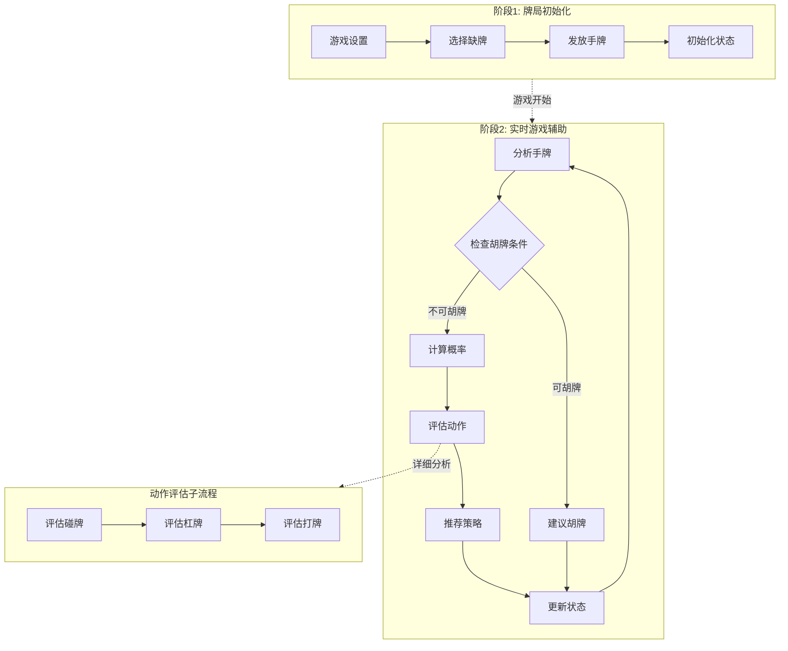

# 欢乐麻将辅助工具设计文档
> 请不要删除AI注释

## 需求分析
> AI注释：保持简单清晰。

欢乐麻将辅助工具系统将为玩家提供血战麻将游戏的智能辅助功能，帮助分析手牌、提供最优打牌建议和胡牌策略。系统主要包含两个阶段：

1. **牌局初始化**: 设置缺牌、初始化手牌、建立游戏状态

2. **实时游戏辅助**: 当玩家需要决策时：
   - 分析当前手牌状态
   - 计算胡牌概率和最优听牌组合
   - 提供碰杠建议
   - 检查胡牌条件
   - 推荐最佳打牌策略

## 工具函数
> AI注释：
> 1. 仔细理解每个工具函数的作用
> 2. 只包含最重要的函数开始

1. **牌型分析** (`utils/card_analyzer.py`)
   - 分析手牌组合，识别顺子、刻子、对子等牌型

2. **胡牌检测** (`utils/win_checker.py`)
   - 检查是否满足胡牌条件（不超过2门花色）
   - 验证牌型组合是否构成胡牌

3. **概率计算** (`utils/probability_calculator.py`)
   - 计算各种牌的剩余张数
   - 估算胡牌概率和听牌成功率

4. **策略引擎** (`utils/strategy_engine.py`)
   - 基于当前牌局状态生成最优策略
   - 核心函数：
     - `analyze_hand()`: 分析手牌状态和可能组合
     - `suggest_discard()`: 推荐打出的牌
     - `evaluate_action()`: 评估碰杠等动作的价值

5. **缺牌管理** (`utils/missing_suit_manager.py`)
   - 管理玩家缺牌逻辑，确保缺牌必须打出

6. **牌局状态** (`utils/game_state.py`)
   - 维护整个牌局的状态信息
   - 核心函数：
     - `update_game_state()`: 更新游戏状态
     - `get_remaining_cards()`: 获取剩余牌数统计
     - `track_discarded_cards()`: 跟踪已打出的牌

## 流程架构
> AI注释：
> 1. 考虑代理、映射归约、RAG和工作流设计模式
> 2. 提供简洁的高级工作流描述

系统采用实时分析模式结合状态机设计，分为两个主要阶段：

### 1. 牌局初始化阶段
1. **SetupGameNode**: 初始化游戏参数和牌库
2. **ChooseMissingSuitNode**: 选择缺牌花色
3. **DealInitialHandNode**: 发放初始手牌
4. **InitializeStateNode**: 建立游戏状态跟踪

### 2. 实时游戏辅助阶段
1. **AnalyzeHandNode**: 分析当前手牌状态
2. **CheckWinConditionNode**: 检查是否可以胡牌
3. **CalculateProbabilityNode**: 计算各种行动的成功概率
4. **EvaluateActionsNode**: 评估可能的动作（碰、杠、胡）
5. **SuggestStrategyNode**: 基于分析结果提供最优策略
6. **UpdateGameStateNode**: 更新游戏状态

注意：系统在每次玩家行动后都会重新分析当前状态。

### 流程图
> AI注释：仔细决定是否使用批处理/异步节点/流程



## 数据结构

系统操作两种主要数据结构：

### 阶段1: 游戏初始化数据
```python
game_setup_data = {
    # 游戏配置
    "player_count": 4,  # 玩家数量
    "game_type": "血战麻将",  # 游戏类型
    
    # 牌库设置
    "total_cards": 108,  # 总牌数（万筒条各36张）
    "card_deck": {
        "万": [1,1,1,1,2,2,2,2,...,9,9,9,9],  # 万字牌
        "筒": [1,1,1,1,2,2,2,2,...,9,9,9,9],  # 筒子牌  
        "条": [1,1,1,1,2,2,2,2,...,9,9,9,9]   # 条子牌
    },
    
    # 玩家设置
    "players": [
        {
            "id": "player_1",
            "missing_suit": "万",  # 缺牌花色
            "initial_hand": [],    # 初始手牌
            "is_ai_assisted": True # 是否开启AI辅助
        }
    ],
    
    # 游戏状态
    "current_turn": 0,  # 当前轮次
    "game_phase": "initial",  # 游戏阶段
}
```

### 阶段2: 实时游戏辅助数据
```python
game_state_data = {
    # 当前玩家状态
    "current_player": {
        "id": "player_1",
        "hand_cards": [
            {"suit": "万", "value": 1, "count": 2},
            {"suit": "筒", "value": 5, "count": 1},
            # ... 其他手牌
        ],  # 当前手牌
        "missing_suit": "万",  # 缺牌花色
        "exposed_groups": [
            {"type": "peng", "suit": "条", "value": 3},  # 已碰的牌
            {"type": "gang", "suit": "筒", "value": 7}   # 已杠的牌
        ],
        "can_win": False,  # 是否可以胡牌
    },
    
    # 牌局信息
    "game_info": {
        "remaining_cards": {
            "万": {"1": 2, "2": 4, ...},  # 剩余牌数统计
            "筒": {"1": 3, "2": 1, ...},
            "条": {"1": 0, "2": 4, ...}
        },
        "discarded_cards": [
            {"suit": "万", "value": 2, "player": "player_2"},
            # ... 已打出的牌
        ],
        "last_discarded": {"suit": "条", "value": 5, "player": "player_3"},
    },
    
    # 分析结果
    "analysis_result": {
        "hand_analysis": {
            "suit_count": {"万": 3, "筒": 7, "条": 4},  # 各花色数量
            "is_valid_for_win": True,  # 是否满足胡牌花色条件（≤2门）
            "potential_groups": [
                {"type": "sequence", "cards": [{"suit": "筒", "value": 3}, {"suit": "筒", "value": 4}, {"suit": "筒", "value": 5}]},
                {"type": "triplet", "cards": [{"suit": "条", "value": 2}, {"suit": "条", "value": 2}, {"suit": "条", "value": 2}]}
            ]
        },
        
        "win_probability": 0.23,  # 胡牌概率
        "listening_cards": [  # 听牌
            {"suit": "筒", "value": 6, "probability": 0.15},
            {"suit": "条", "value": 8, "probability": 0.08}
        ],
        
        "action_suggestions": [
            {
                "action": "discard",
                "card": {"suit": "万", "value": 4},
                "reason": "缺牌必须打出",
                "priority": 1
            },
            {
                "action": "peng", 
                "card": {"suit": "条", "value": 5},
                "value_score": 0.7,
                "priority": 2
            }
        ]
    },
    
    # AI建议
    "ai_suggestion": {
        "recommended_action": "discard",
        "recommended_card": {"suit": "万", "value": 4},
        "reasoning": "这是缺牌必须打出，同时不影响当前听牌状态",
        "alternative_strategies": [
            {
                "action": "keep_current_hand",
                "reason": "当前已经听牌，等待胡牌机会"
            }
        ]
    }
}
```

## 节点规范

### 阶段1: 游戏初始化节点

#### 1. SetupGameNode
- **用途**: 初始化游戏基本设置和牌库
- **设计**: 常规节点
- **数据访问**:
  - 读取: "player_count", "game_type"
  - 写入: "card_deck", "total_cards"

#### 2. ChooseMissingSuitNode  
- **用途**: 为每个玩家选择缺牌花色
- **设计**: 批处理节点（处理每个玩家）
- **数据访问**:
  - 读取: "players"
  - 写入: "missing_suit" (为每个玩家)

#### 3. DealInitialHandNode
- **用途**: 发放初始手牌给每个玩家
- **设计**: 批处理节点
- **数据访问**:
  - 读取: "card_deck", "players"
  - 写入: "initial_hand" (为每个玩家)

#### 4. InitializeStateNode
- **用途**: 建立游戏状态跟踪系统
- **设计**: 常规节点
- **数据访问**:
  - 读取: "players", "card_deck"
  - 写入: "current_turn", "game_phase"

### 阶段2: 实时游戏辅助节点

#### 5. AnalyzeHandNode
- **用途**: 分析当前玩家手牌状态
- **设计**: 常规节点
- **执行**:
  - 统计各花色牌数
  - 识别可能的牌型组合
  - 检查是否满足胡牌花色限制（≤2门）
- **数据访问**:
  - 读取: "hand_cards", "missing_suit"
  - 写入: "hand_analysis"

#### 6. CheckWinConditionNode
- **用途**: 检查是否满足胡牌条件
- **设计**: 常规节点
- **执行**:
  - 验证花色数量限制
  - 检查牌型组合是否构成胡牌
  - 考虑已有的碰杠组合
- **数据访问**:
  - 读取: "hand_cards", "exposed_groups", "hand_analysis"
  - 写入: "can_win"
- **行动**:
  - 如果可以胡牌 → 建议胡牌
  - 如果不能胡牌 → 继续分析

#### 7. CalculateProbabilityNode
- **用途**: 计算各种行动的成功概率
- **设计**: 常规节点
- **数据访问**:
  - 读取: "hand_cards", "remaining_cards", "hand_analysis"
  - 写入: "win_probability", "listening_cards"

#### 8. EvaluateActionsNode
- **用途**: 评估可能的动作（碰、杠、打牌）
- **设计**: 批处理节点（处理每种可能动作）
- **数据访问**:
  - 读取: "hand_cards", "last_discarded", "win_probability"
  - 写入: "action_suggestions"

#### 9. SuggestStrategyNode
- **用途**: 基于分析结果生成最优策略建议
- **设计**: 常规节点
- **数据访问**:
  - 读取: "action_suggestions", "hand_analysis", "win_probability"
  - 写入: "ai_suggestion"

#### 10. UpdateGameStateNode
- **用途**: 根据玩家行动更新游戏状态
- **设计**: 常规节点
- **数据访问**:
  - 读取: "current_player", "last_action"
  - 写入: "remaining_cards", "discarded_cards", "current_turn"

### 系统运行时逻辑（非节点）
系统在游戏过程中持续监控状态：

```python
def monitor_game_state(game_data):
    """在游戏过程中持续监控和分析."""
    # 监听玩家动作
    player_action = get_player_action()
    
    # 检查缺牌逻辑
    if is_missing_suit_card(player_action.card, game_data["current_player"]["missing_suit"]):
        enforce_discard_rule(player_action)
    
    # 更新牌局状态
    update_remaining_cards(game_data, player_action)
    
    # 重新分析并提供建议
    return analyze_and_suggest(game_data) 
```
